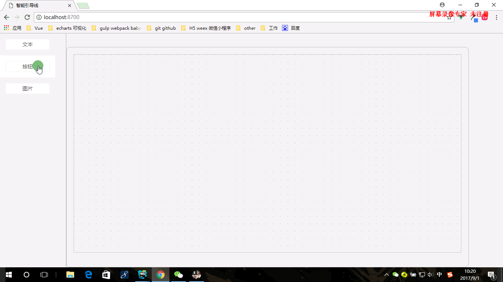

# promptLine

> 网格系统中的智能引导线以及拖拽吸附功能

## 前言
基本架子基于 - [yelingfeng-autoPosLine](https://github.com/yelingfeng/autoPosLine)

核心实现一个编辑坐标区 提示线功能 拖拽吸附功能

参考案例
- [墨刀编辑器](https://modao.cc)
- [易企秀](http://www.eqxiu.com/)



## Development

```javascript
npm i cooking-cli -g

npm install
npm run dev

```


